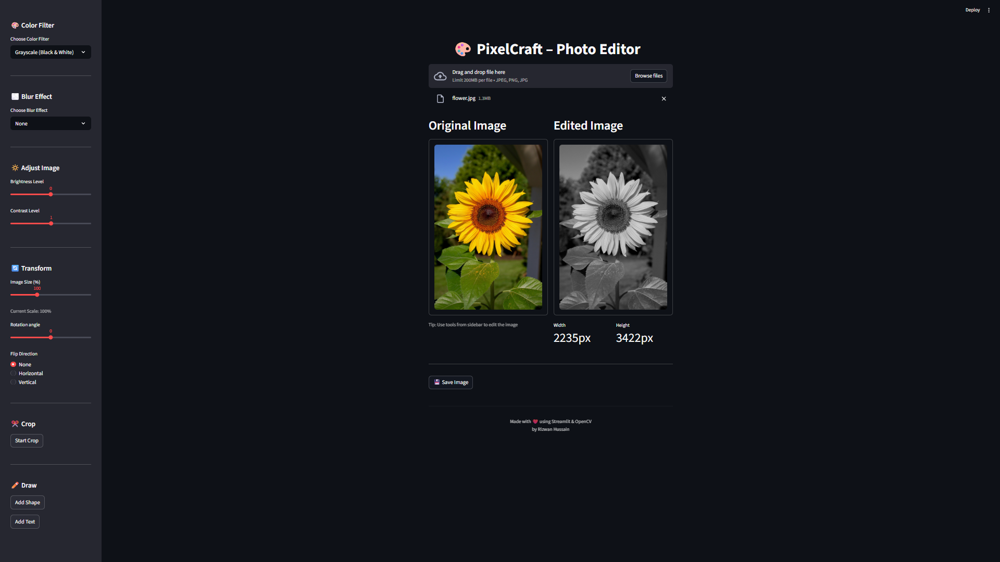

# 🎨 PixelCraft – Photo Editor


PixelCraft is a modern, interactive **Photo Editor Web App** built using **Streamlit + OpenCV**.  
Edit images directly in your browser with filters, transformations, drawing tools, cropping, and text overlays.

🚀 Built completely in **Python** — no frontend frameworks required.

---

## 🎥 Demo

▶️ **Watch Demo Video:** [assets/demo.mp4](assets/demo.mp4)

---

## 📸 Screenshots

### 🏠 Home Screen


---

## ✨ Features

### 🎨 Filters
- Grayscale (Black & White)
- Negative / Invert
- Red / Green / Blue channels

### 🌫️ Blur Effects
- Normal Blur
- Gaussian Blur
- Median Blur

### 🔆 Adjustments
- Brightness
- Contrast

### 🔄 Transformations
- Resize (scale %)
- Rotate
- Flip (Horizontal / Vertical)

### ✂️ Crop Tool
- Drag-to-select crop
- Apply / Cancel crop

### ✏️ Drawing Tools
- Line
- Rectangle / Square
- Circle
- Adjustable thickness
- Filled shapes

### 📝 Text Tool
- Click anywhere to place text
- Multiple fonts
- Size & thickness control
- Custom colors

### 💾 Export
- Save edited image
- PNG / JPEG formats

---

## 🛠️ Tech Stack

- **[Streamlit](https://streamlit.io/)**: For creating the interactive web application interface.
- **[OpenCV](https://opencv.org/)**: For all core image processing and manipulation tasks.
- **[Pillow (PIL)](https://python-pillow.org/)**: Used for image handling between different libraries and formats.
- **[NumPy](https://numpy.org/)**: For numerical operations and handling image arrays.
- **[streamlit-cropper](https://pypi.org/project/streamlit-cropper/)**: A Streamlit component for the interactive image cropping functionality.
- **[streamlit-image-coordinates](https://pypi.org/project/streamlit-image-coordinates/)**: A Streamlit component to capture click coordinates on images for drawing and text placement.


---

### Installation

1.  **Clone the repository:**
    ```sh
    git clone https://github.com/rizwanhussain01/pixelcraft-photo-editor.git
    cd pixelcraft-photo-editor
    ```

2.  **Install the dependencies:**
    ```sh
    pip install -r requirements.txt
    ```

3.  **Run the application:**
    ```sh
    streamlit run app.py
    ```
    Your web browser will open with the PixelCraft application running.

## 📁 Project Structure

```
pixelcraft-photo-editor/
│
├── app.py             # Main Streamlit application file, handles UI and state management
├── adjustments.py     # Functions for brightness and contrast adjustments
├── draw.py            # Functions for drawing shapes and text on the image
├── filters.py         # Functions for color filters and blur effects
├── transform.py       # Functions for resizing, rotating, and flipping
├── utils.py           # Utility functions (e.g., color conversion)
├── requirements.txt   # Project dependencies
├── assets/            # Directory for storing static assets like images and demos
└── README.md          # This file
```

## 👨‍💻 Author

Made with ❤️ using Streamlit & OpenCV  
**Rizwan Hussain**

GitHub: https://github.com/rizwanhussain01
---

## 📜 License

This project is licensed under the MIT License. See the LICENSE file for details.
